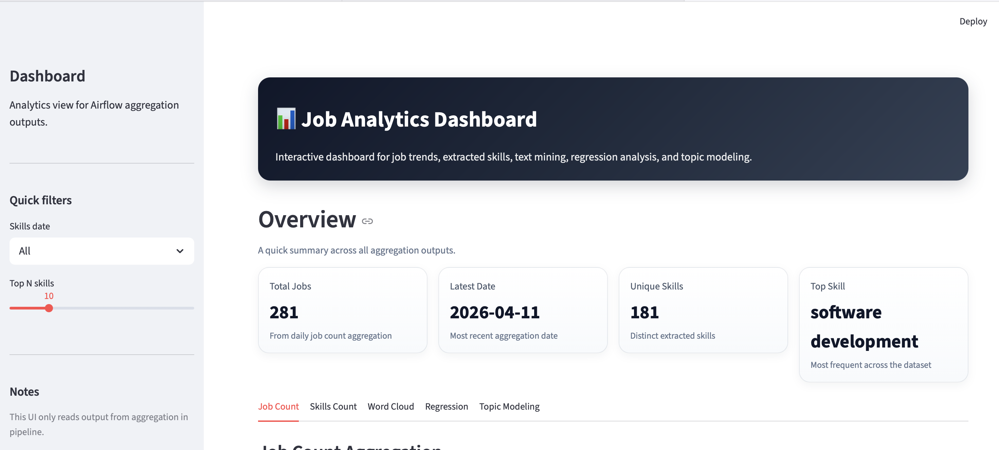
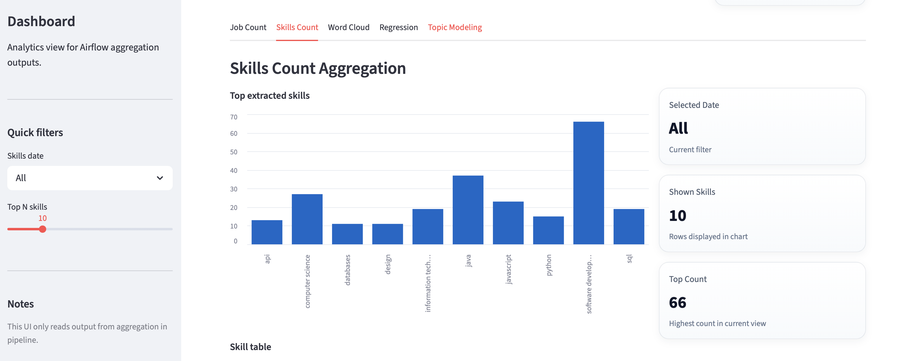
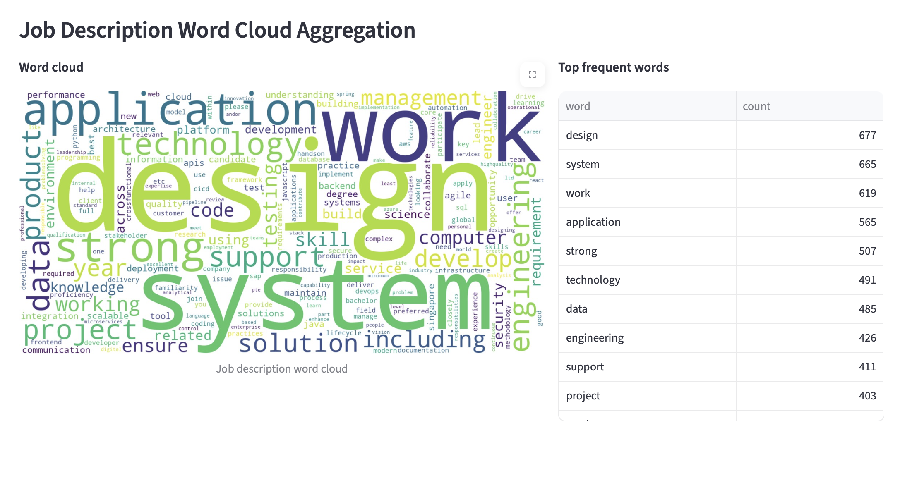
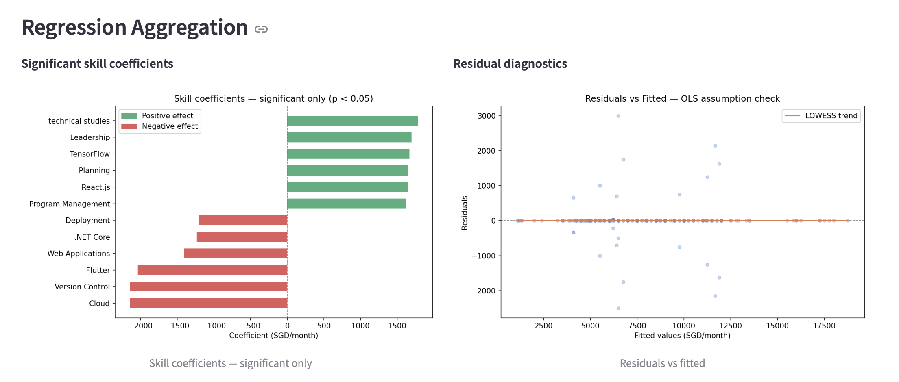
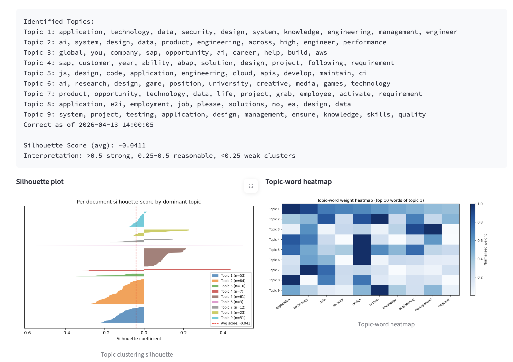

# IS3107 Data Engineering

## What is it?

This ingests job portal data from two sources:
- RapidAPI
- MyCareersFuture

We aim to get the IT job description in Singapore to understand the current trend (skills) so job seekers can put more time on practicing these skills which increases the chance to have a job.  

We did try the following, but we dropped it:
- Telegram (because it did not have a good enough schema)
- AdZuma (because it did not provide the full job description)
- Reed.co.uk (because the API was behind CloudFlare despite it being an API)

How do you install?

Very simple: Just build the docker file. Just:
```
docker compose up --build
```

To run the dash board:
```
docker compose up dashboard
```
## Data source 
In this project due to limitation quota in RapidAPI, we schedule to run this pipeline for every 24hrs.

## ETL Pipeline (Airflow)
In this part, raw data are collected in json format. For each job description, we extract job name, skill, company, salary (if include).

All the tasks are straightforward except extracting job skills from RapidAPI because all the skills are stored inside job description. There are two ways to extract skills: one is using nlp, second is key word matching. In this project, we choose the second approach because there are no data  to validate  if nlp can extract the right skills from RapidAPI. In the second approach, we download the IT skills dataset from kaggle and do the full screen to extract skill from job description. The biggest limitation is its inability to extract duplicate skills from the description (JavaScript and Js are treated two distinct entries).

After processing the data, we store it in mongoDB for furthur aggregation and dashboard visualization.

## ML and DashBoard

There are 5 features we include in dashboard:
- Job Count
- Skill Count
- Word Cloud
- Regression 
- Topic Modelling




<p align="center"><em>Figure 1: Home page of the dashboard</em></p>

The dashboard home page provides an overview of all key analytics features in a single interface. From here, users can quickly navigate through the five main components: Job Count, Skill Count, Word Cloud, Regression, and Topic Modelling. Each module is designed to offer a different perspective on the dataset, ranging from high-level trends to deeper analytical insights.

---


<p align="center"><em>Figure 2: Trend in number of job</em></p>

---



<p align="center"><em>Figure 3: Top skills</em></p>

---



<p align="center"><em>Figure 4: Word cloud aggregation</em></p>

---



<p align="center"><em>Figure 5: Regression aggregation</em></p>

---



<p align="center"><em>Figure 6: Topic modelling aggregation</em></p>